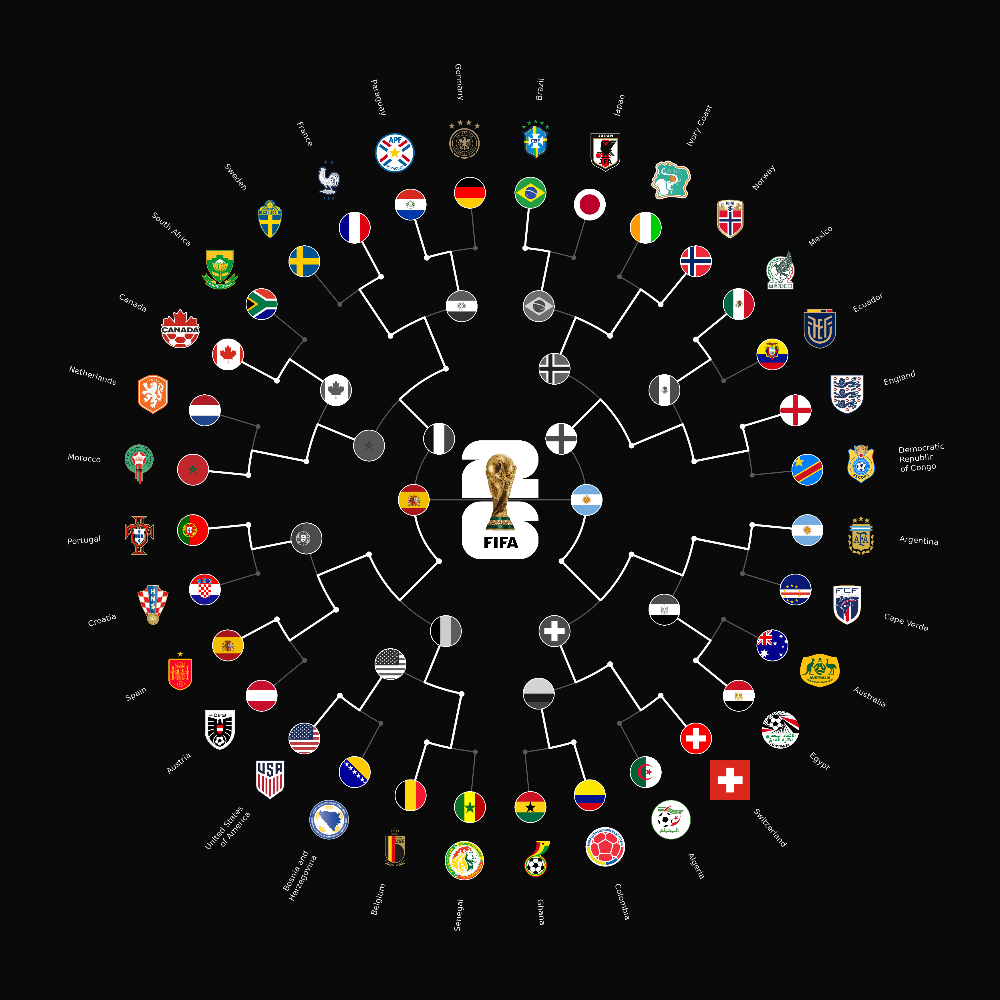

# World Cup 2026 — Circular Knockout Bracket

A radial visualisation of the FIFA World Cup 2026 knockout stage. The 32
Round-of-32 teams sit on the outer ring; winners advance **inward** along a white
path toward the champion at the centre. Results are pulled live from
[openfootball/worldcup.json](https://github.com/openfootball/worldcup.json).

**▶ [Interactive version](https://v7t.github.io/world-cup-2026-bracket/)** —
drag the slider to replay the tournament game by game.



## What's here

| File | Purpose |
| --- | --- |
| `WC26_Brackets.py` | Renders the static bracket to `wc2026_bracket.png` + `wc2026_bracket.svg` |
| `build_web.py` | Builds the interactive page into `docs/index.html` |
| `download_resources.py` | Fetches `worldcup.json`, team crests and flags |
| `flags_svg/`, `crests_svg/` | Vector flags and federation crests |

## Usage

```bash
python WC26_Brackets.py              # static bracket -> PNG + SVG
python WC26_Brackets.py --simulate   # resolve undecided matches at random
python WC26_Brackets.py --seed=7     # reproducible simulation
python WC26_Brackets.py --no-grey    # keep eliminated teams in colour
python build_web.py                  # interactive page -> docs/index.html
```

## The interactive page

`build_web.py` produces a single self-contained HTML file (no server, no CDN):

- **Slider** — scrub from 0 games played to the last decided match; the bracket
  is re-derived for each position, so a team stays in colour until the game that
  actually knocks it out.
- **Results list** — grouped by round, with scores (incl. `aet` / penalties).
  Click any match to jump the slider to it.
- **Play** — animates the whole tournament.

Flags, crests and the logo are embedded once as SVG data-URIs and referenced via
`<use>`, so scrubbing is instant and everything stays resolution-independent.

## Rendering notes

- SVGs are rasterised with **resvg**, not cairosvg: the 2026 logo masks an
  embedded raster trophy with a luminance mask that cairosvg renders incorrectly
  (see-through trophy plus a grey band).
- The bracket geometry, connector lines and text are true vectors. The trophy
  inside the official logo is a photograph, so it stays raster — everything
  around it, including the logo's "26", is vector.

## Requirements

Python 3.14+ — see `pyproject.toml`.

```bash
uv sync          # or: pip install matplotlib numpy pillow resvg-py selenium
```

`selenium` (plus Chrome) is only needed by `download_resources.py` when
re-downloading crests; rendering the bracket does not use it.

## Credits

None of the data or artwork here is mine — this project only draws it:

| Source | Used for |
| --- | --- |
| [openfootball/worldcup.json](https://github.com/openfootball/worldcup.json) | Fixtures, scores and results (`worldcup.json`) |
| [flag-icons](https://github.com/lipis/flag-icons) by Panayiotis Lipiridis | Country flags (`flags_svg/`, `flags_png/`) |
| [football-logos.cc](https://football-logos.cc/national-teams/) | Federation crests (`crests_svg/`) and the tournament logo |

The FIFA World Cup 2026 emblem, the trophy image and all federation crests are
the trademarks and property of FIFA and the respective national associations.
They are used here for illustration in a non-commercial, unofficial fan project;
this repository is not affiliated with, endorsed by, or sponsored by FIFA.

Thanks especially to the [openfootball](https://github.com/openfootball) project,
which is what makes an always-current bracket possible.
